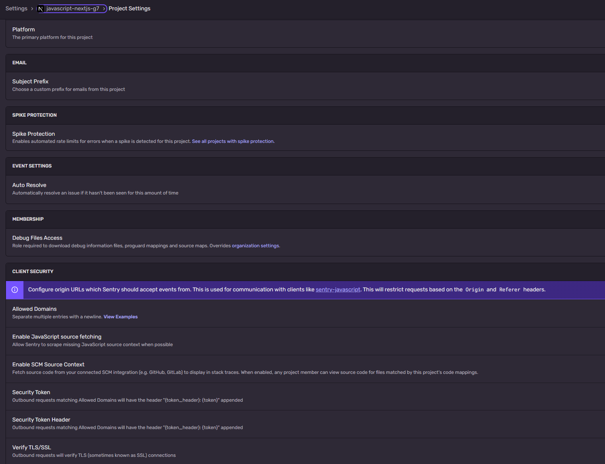

# SODA Pilot Report: Coffee Connect
**Date:** June 17, 2026  
**Location:** Coffee Connect, Futureland  
**Attendees:** 19  
**URL:** grabsoda.app  
**Status:** Soft pilot complete. No acts fired. Auth, check-in, Intel, and room data capture validated with real people.

---

## What this report is

This is the post-pilot engineering and product brief for the Coffee Connect soft launch of SODA. It is formatted to be fed directly into Claude Code in VS Code as a build instruction set. Every finding includes a root cause, a fix, and the code location or pattern to target. The second half is a reference document for the corpus.

Feed this to Claude Code with:

```
Read CLAUDE.md and the brain files, then read this pilot report in full before touching any code. Every fix listed is a build task. Work through them in the order listed. Log every change to the build error log. Do not introduce em dashes anywhere.
```

---

## Pilot validation: what worked

These are confirmed live with real people and do not need to change.

- Check-in via QR and room entry: working
- Presence and attendee list in real time: working, 19 people captured
- Offers and Needs chip display in the room: working
- Intel tab with live match computation: working (145 matches, 62 mutual, top connector identified, avg overlap calculated)
- Most Wanted (need greater than offer) gap analysis: working and genuinely useful
- CSV export of room data: working
- Nudges: working mechanically
- Survey: working
- Acts: working (not fired live, confirmed functional)
- Room controls (Announce, OPS, Admin): working
- End the Night: working

The Intel tab is the standout. 145 matches, 62 mutual, Lorena Medina as top connector with 18 matches, and a Most Wanted section showing that Looking for Work (5 need, 0 offer) and Funding (4 need, 0 offer) are the true room gaps. That is real, actionable intelligence from a 19-person room. The engine works.

---

## Bug 1 (Priority 1): Auth double-email loop breaks onboarding

### What happened
New users were prompted to sign up, then immediately received two emails: a sign-up confirmation email AND a code email. Clicking the confirmation link re-triggered the onboarding flow, creating a loop. People got confused and some re-onboarded.

### Root cause
Supabase email confirmation is enabled alongside the OTP code flow. When a new user signs up, Supabase sends both a confirmation email (its default behavior) and the OTP code. The confirmation email contains a link that re-initializes the auth session, which conflicts with the in-progress OTP flow and looks to the user like they are being asked to start over.

### Fix
Two steps, both required.

Step 1: In the Supabase dashboard, go to Authentication, Email, and disable "Confirm email" for the OTP flow. The OTP code is itself the confirmation. A separate confirmation email is redundant and confusing for a sign-in-code flow.

Step 2: In the Next.js auth handling, check the email template in Supabase for the OTP sign-in. Make sure it sends one email with one clear action: "Your SODA code is XXXX. Enter it to join the room." No link, no confirmation language, no secondary CTA.

### Code location
`supabase/auth` settings in the Supabase dashboard (no code change). The email template lives in Supabase Authentication, Email Templates, Magic Link or OTP.

### Verification
Sign up as a new user. Confirm exactly one email arrives. Confirm it contains only the code. Confirm entering the code works without any confirmation step.

---

## Bug 2 (Priority 1): Auth front door UX requires Clerk

### What happened
The Supabase Auth front door was confusing enough in the pilot to surface as a trust issue. The sign-in experience needs to be cleaner, more intentional, and more trustworthy for a public-facing event product.

### Decision reversal
SODA-025 locked Supabase Auth as the single identity system and explicitly deferred Clerk. That decision is partially reversed by the pilot. The front door UX is a product-quality issue, not just a technical one. Clerk's prebuilt components are genuinely better for a consumer event product where someone's first experience is the sign-in screen in a room full of people.

The reversal is scoped: Clerk handles the attendee-facing front door (sign-in, code delivery, social login). Supabase Auth remains for internal host and operator flows where the polish matters less. The Supabase Third-Party Auth native integration connects both.

### Fix
Install Clerk. Wire the attendee-facing sign-in flow through Clerk's prebuilt components. The Supabase client still serves data through RLS; Clerk issues the JWT that Supabase validates through the native Third-Party Auth integration. RLS policies for attendee tables must be written against the Clerk sub claim, not auth.uid(). See the Clerk Auth Best Practices doc for the full integration pattern.

### Code locations
- Install: `@clerk/nextjs`
- Middleware: `proxy.ts` (ClerkProvider wraps the app at root)
- RLS: all attendee-facing table policies change from `auth.uid()` to reading the Clerk sub claim from the JWT
- Supabase: add the Clerk Third-Party Auth integration in the Supabase dashboard

### Note on the double-email bug
Bug 1 may be partially resolved by switching to Clerk's OTP flow, which handles the email delivery and confirmation in one clean step. Fix Bug 1 in Supabase first as a short-term patch. Then wire Clerk as the permanent solution.

---

## Finding 3 (Priority 1): Chips are too vague to produce useful matches

### What happened
The Intel tab showed 145 matches and 62 mutual, which sounds strong. But looking at the chip data: 14 of 19 people offered Collaboration. 10 of 19 people needed Introductions. When the most common chip in the room is also the most generic, matching on it is like matching on "I exist." The nudges that came from this data were vague because the input data was vague.

The Most Wanted section actually surfaced the useful signal (Looking for Work and Funding are genuine gaps) precisely because those chips are specific enough to be meaningful.

### Root cause
The chip taxonomy has no specificity layer. "Mentorship" tells you nothing about what domain. "Collaboration" tells you nothing about what kind of work. The room-level aggregate data shows everyone offering the same things, making the match list long but low-signal.

### Fix: the [X] in [Y] chip pattern

Change chip input from a single-select chip to a two-part entry: a category chip and a specificity field inline.

The UI pattern:
```
Offers:   [ Mentorship ]  in  [ _______________ ]
          [ Collaboration ]  on  [ _______________ ]
```

The specificity field is optional but surfaced. A guest can tap Mentorship and leave the field blank, and the chip saves as just "Mentorship." But if they type "design" or "early-stage startups," the chip saves as "Mentorship in design" and the match engine has real signal.

### Data model change
The chip value stored in the attendance row changes from a plain string to an object: `{ category: "Mentorship", context: "design" }`. The display in the room shows "Mentorship in design" as the chip label. The Intel match engine matches on category first (same category is a match) and surfaces context as the nudge-level detail ("You both offer Mentorship. She focuses on design; you focus on go-to-market").

### What this fixes downstream
Nudge quality improves directly because the AI draft call now has specific context to work with. "You both offer Mentorship in early-stage startups" is a usable nudge prompt. "You both offer Collaboration" is not.

### Code locations
- Attendance schema: the `offer` and `need` columns change from `text[]` to `jsonb[]` to hold `{category, context}` objects
- Chip editor component: add the inline specificity input
- Intel match engine: match on `category`, surface `context` in match output
- Nudge draft prompt: include `context` in the Claude API call

---

## Finding 4 (Priority 2): No room snapshot when the night ends

### What happened
When End the Night is tapped, the analytics disappear and only a CSV download is available. The host loses the visual summary the moment the room closes. This is the one time the host most wants to see what the room produced.

### What should happen
When the room closes, the Intel tab freezes into a static room snapshot: a visual summary card with the key numbers from the night, the same data that was live during the event, now preserved as the permanent record of that room.

### The room snapshot should show
- Total attendees
- Total matches and mutual matches
- Top connector with match count
- Average overlap score
- Most wanted gaps (need greater than offer)
- Top 5 matches by strength
- Timestamp: room opened, room closed, duration

This snapshot is the host's deliverable. It is what they show their team, their stakeholders, or their next event sponsor. It should live on the closed event page and be exportable as a PDF alongside the CSV.

### Code locations
- Event close handler: when status changes to closed, write a `room_snapshot` JSON field to the events table capturing the Intel computed values at that moment
- Closed event page: render the snapshot as a visual summary card rather than showing the live Intel tab
- Export: generate a PDF of the snapshot using the existing stack

---

## Finding 5 (Priority 2): Nudge quality is downstream of chip quality

### What happened
Nudges work mechanically but the relational data they were generated from was too vague to produce meaningful suggestions. When everyone offers Collaboration and everyone needs Introductions, the AI has nothing specific to connect two people on.

### This is not a nudge bug
The nudge mechanism is correct. The draft generates, the two-call gate works, nothing sends without approval. The problem is the input, not the plumbing. Fix the chips (Finding 3) and the nudge quality improves automatically because the Claude API call has specific context.

### One additional nudge improvement
The current nudge likely shows both people's full chip lists and asks for a connection. The prompt should be tightened to lead with the strongest overlap signal, the chip where both the category and the context match, rather than listing everything. If two people both offer Mentorship in design, that is the lead. Everything else is supporting context.

### Prompt adjustment for Claude Code
Update the nudge draft prompt in `/api/draft` to:
1. Rank chips by specificity (chips with context beat chips without)
2. Lead the prompt with the highest-specificity mutual chip
3. Include the context field in the prompt, not just the category

---

## Finding 6 (Priority 3): Room view needs a Wall or async layer

### What the screenshots show
The attendee-facing room has a Room tab and a Wall tab. The Wall was visible in the guest-side screenshots. This suggests the product already has an async content layer alongside the live presence view. Make sure the Wall state and its content model are clearly specced so the Intel and Wall data stay separate concerns.

---

## Decision log updates from this pilot

### SODA-025 partial reversal: Clerk for the attendee front door
Clerk is reinstated for the attendee-facing sign-in flow based on pilot UX evidence. The front door is a product-quality issue. Supabase Third-Party Auth native integration connects Clerk to Supabase RLS. RLS for attendee tables writes against the Clerk sub claim. See Clerk Auth Best Practices doc for integration pattern. Host and operator flows remain on Supabase Auth.

### SODA-033 amendment: chip data model
The chip data model changes from `text[]` to `jsonb[]` with `{category, context}` per chip. This is a migration, not a schema replacement. Existing chip data is migrated with an empty context field. The privacy policy's data description is updated to reflect that chips may include context the user types.

---

## Build order for Claude Code

Work through these in order. Do not start the next until the current one verifies.

1. Fix the Supabase auth email confirmation setting (dashboard change, no code, 10 minutes). Verify with a fresh sign-up that exactly one email arrives.

2. Wire Clerk for the attendee sign-in flow. Update RLS policies for attendee tables to use the Clerk sub claim. Verify sign-in works end to end with a real email.

3. Migrate the chip schema from `text[]` to `jsonb[]`. Write the migration. Update the chip editor to show the optional specificity field inline. Verify existing data migrates cleanly.

4. Update the Intel match engine to match on chip category and surface chip context in match output. Update the nudge draft prompt to lead with the highest-specificity mutual chip.

5. Build the room snapshot. Write the snapshot to the events table when End the Night fires. Render it as a visual summary on the closed event page. Add PDF export.

6. After all five are verified, run the Supabase Security and Performance advisors and clear any new findings introduced by the schema change.

---

## What the pilot proved

The engine is real. 19 people in a room, 145 matches computed live, a top connector identified, a gap analysis that was genuinely useful to the host. The Most Wanted section showing that Looking for Work (5 need, 0 offer) and Funding (4 need, 0 offer) are unmet needs in the room is exactly the kind of intelligence no name tag could produce. That is Equalpoint's proof of concept, delivered on the first live run.

The fixes are not architecture changes. They are a configuration correction, a front door upgrade, a data model improvement, and a post-event surface. The room works. Now make it easier to enter and more specific inside.

*A name tag knows you showed up. SODA knows who you became to the room. Coffee Connect proved the room. Black Tech Week proves it at scale.*

